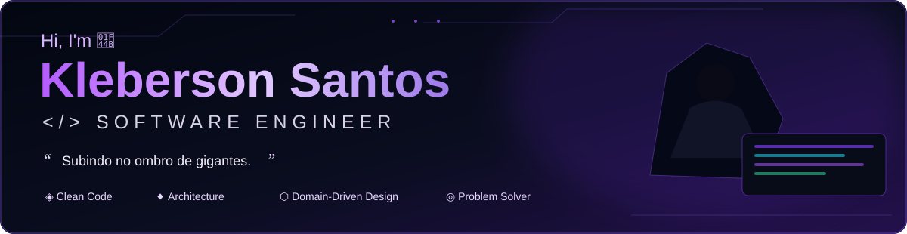

<div align="center">

<a href="https://github.com/softwarekleberson">
  
</a>

</div>

<br>

<table>
<tr>
<td width="36%" valign="top">

## 👨‍💻 About Me

Software Engineer passionate about building **maintainable, scalable and well-structured software**.

I focus on understanding the **domain deeply** before writing code and creating solutions that generate real value.

<br>

📍 **Location:** Brazil  
💼 **Status:** Open to new opportunities  
🎯 **Goal:** Software Engineer  
🧠 **Focus:** Backend · Architecture · Quality  
💡 **Mindset:** Always learning

</td>

<td width="64%" valign="top">

## ⚡ Tech Stack

| | Technologies |
|---|---|
| 💻 **Languages** | Java · C# · Python · JavaScript |
| 🚀 **Backend** | Spring Boot · .NET · REST API · Spring Security |
| 🎨 **Frontend** | React · HTML5 · CSS3 |
| 🗄️ **Databases** | MySQL · Oracle · Redis |
| ☁️ **Cloud & DevOps** | Azure · Docker · Git |
| 🏛️ **Architecture** | Clean Architecture · DDD · SOLID · Object-Oriented Design |
| 🧪 **Quality** | JUnit · Playwright · JaCoCo |
| 📊 **Observability** | Actuator · Prometheus · Grafana |

</td>
</tr>
</table>

---

# 🚀 Featured Project

<table>
<tr>
<td width="43%" valign="top">

## 🛒 Clean Ecommerce

**A complete e-commerce backend created as a practical study of software architecture and domain modeling.**

### Core principles

`Clean Architecture`  
`DDD`  
`SOLID`  
`Object Calisthenics`

### Engineering highlights

- 🔐 Authentication with JWT
- 🛍️ Shopping Cart & Checkout
- 📦 Orders & Stock
- 💳 Payment strategies
- ⚡ Redis caching
- 🗃️ Flyway migrations
- 📊 Observability
- 🧪 Automated tests
- 🐳 Dockerized infrastructure

<br>

<a href="https://github.com/softwarekleberson/E-commerce">
  
</a>

</td>

<td width="57%" valign="top">

## 🏛️ Architectural Overview

```text
┌───────────────────────────────────────┐
│              PRESENTATION             │
│       REST Controllers · DTOs         │
│          Validation · HTTP            │
└───────────────────┬───────────────────┘
                    │
                    ▼
┌───────────────────────────────────────┐
│               APPLICATION             │
│       Use Cases · Application Rules   │
│            Orchestration              │
└───────────────────┬───────────────────┘
                    │
                    ▼
┌───────────────────────────────────────┐
│                 DOMAIN                │
│      Entities · Value Objects         │
│       Business Rules · Aggregates     │
└───────────────────┬───────────────────┘
                    │
              Dependency
               Inversion
                    │
                    ▼
┌───────────────────────────────────────┐
│             INFRASTRUCTURE            │
│ JPA · Hibernate · MySQL · Redis       │
│ Security · Cache · Events · Adapters  │
└───────────────────────────────────────┘
```

**Architectural intent**

> Controllers stay thin.  
> Application services orchestrate.  
> The domain owns business rules.  
> Infrastructure contains technical details.

</td>
</tr>
</table>

### 🔎 Explore the Architecture

| Documentation | Description |
|---|---|
| 🏛️ [Architecture Overview](https://github.com/softwarekleberson/E-commerce/blob/main/doc/docs/architecture.md) | Modules, layers and dependency direction |
| 📚 [Architecture Decisions](https://github.com/softwarekleberson/E-commerce/blob/main/doc/docs/architecture-decisions.md) | Summary of the main architectural decisions |
| 📖 [ADRs](https://github.com/softwarekleberson/E-commerce/blob/main/doc/docs/architecture-decisions.md) | Individual Architecture Decision Records |

---

# 🧠 Architecture Decisions

<table>
<tr>
<td width="20%" align="center">

### 🏛️
**Clean Architecture**

Separates business rules from frameworks and infrastructure.

</td>
<td width="20%" align="center">

### 🧠
**DDD**

The domain drives the model and business behavior.

</td>
<td width="20%" align="center">

### ↕️
**Dependency Inversion**

High-level modules depend on abstractions.

</td>
<td width="20%" align="center">

### 💎
**SOLID**

Design for cohesion, lower coupling and change.

</td>
<td width="20%" align="center">

### 📊
**Observability**

Actuator, Prometheus and Grafana help understand runtime behavior.

</td>
</tr>
</table>

---

# 🧩 How I Think About Software

```text
                    UNDERSTAND
                         │
                         ▼
                  MODEL THE DOMAIN
                         │
                         ▼
                 DEFINE BOUNDARIES
                         │
                         ▼
                  DESIGN THE RULES
                         │
                         ▼
                    IMPLEMENT
                         │
                         ▼
                       TEST
                         │
                         ▼
                     OBSERVE
                         │
                         ▼
                    REFACTOR
                         │
                         ▼
                      EVOLVE
```

> **Good software is not only software that works.  
> Good software is software that can continue to evolve.**

---

# 📈 GitHub

<div align="center">

<a href="https://github.com/softwarekleberson">
  
</a>
<a href="https://github.com/softwarekleberson">
  
</a>

<br><br>

<a href="https://git.io/streak-stats">
  
</a>

</div>

---

# 📚 Currently Learning

<table>
<tr>
<td width="50%" valign="top">

## ⚛️ React

Building interactive and modern frontends while expanding my knowledge of:

- Components
- Hooks
- State management
- API integration
- Frontend architecture

</td>

<td width="50%" valign="top">

## ☁️ Azure

Expanding my cloud engineering knowledge through:

- Cloud fundamentals
- Azure services
- Deployment
- Infrastructure
- Cloud architecture

</td>
</tr>
</table>

---

# 🗺️ Engineering Journey

```text
Object-Oriented Programming
            │
            ▼
          SOLID
            │
            ▼
   Clean Architecture
            │
            ▼
           DDD
            │
            ▼
    Backend Engineering
            │
            ▼
      Observability
            │
            ▼
     Cloud Architecture
            │
            ▼
   Distributed Systems
```

---

# 🤝 Let's Connect

<div align="center">

<a href="https://www.linkedin.com/in/klebersondossantossilva01">
  
</a>
&nbsp;
<a href="https://github.com/softwarekleberson">
  
</a>
&nbsp;
<a href="mailto:kleberson.santos.dev@gmail.com">
  
</a>

</div>

---

<div align="center">

### `Software Engineer`

**Architecture · Domain · Code · Quality · Continuous Learning**

<br>

> **"Subindo no ombro de gigantes."**

<br>

*Continuous learning, building, failing, improving and delivering value.*

</div>